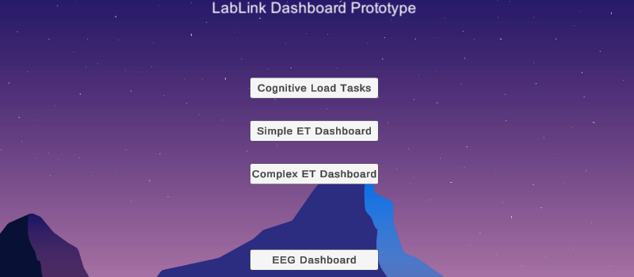
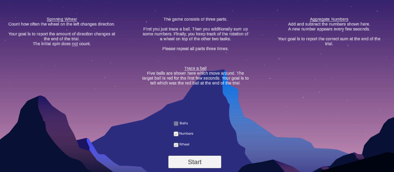
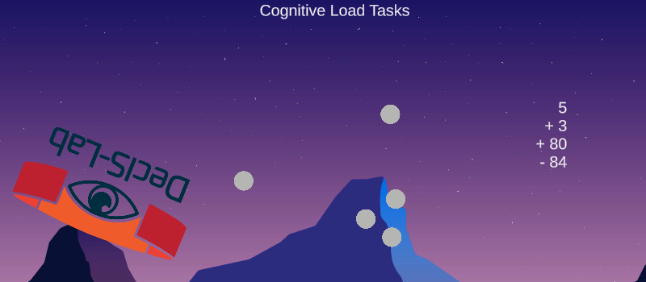
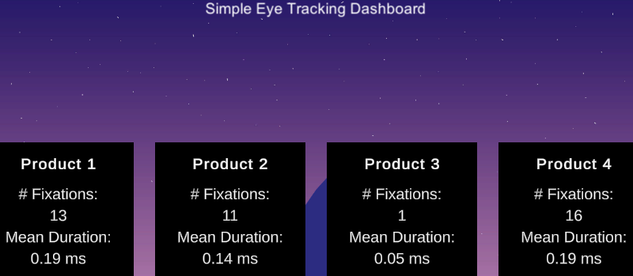
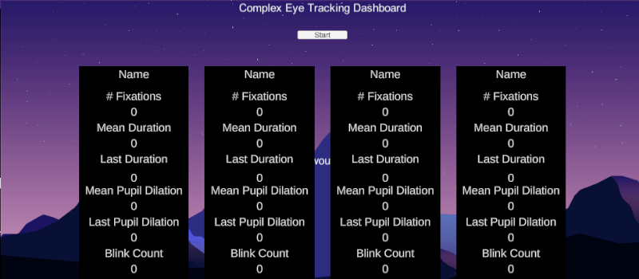
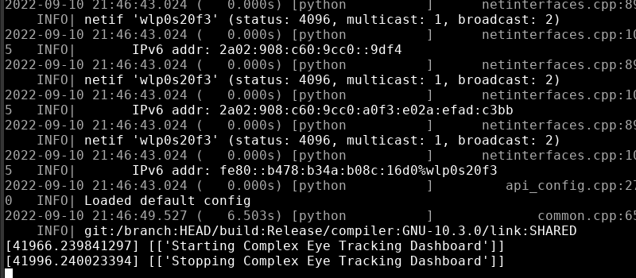

# Unity Dashboard Prototype

Unity environment for bio signal workshop.

## Binaries (in ZIP archives)

[Windows](UnityDashboardPrototype_windows.zip)

[Linux](UnityDashboardPrototype_linux.zip)

# Features

## show treatments to measure different bio signals

- cognitive load tasks
- a simple eye tracking dashboard
- a complex eye tracking dashboard

All treatments send start and stop signals via a LSL outlet.

A simple [LSL inlet](lsl_inlet.py) in python is also provided. 

## visualize bio signals (only small example implementation)

The visuals can be further developed on site.
For now only dummy data is shown for the heart rate.

Further ideas are to show

- heart rate variability
- alpha band values

However, a socket server is listening and a [dummy socket sender](send_sensor_data.py) python script is also provided. This script could be further improved during the workshop (maybe in combination with LSL).

## Preview

## Versions

Using the following software version(s):

- Unity 2021.3.9f1
- LSL4Unity upstream from https://github.com/labstreaminglayer/LSL4Unity
