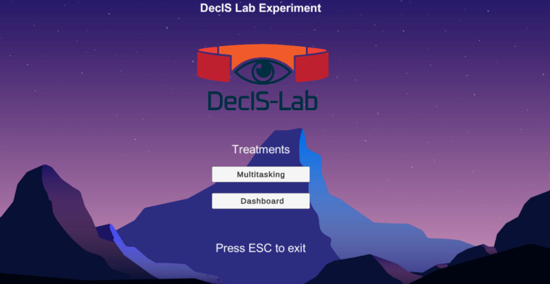

# Unity Cognitive Load

Unity environment to create cognitive load.

## Preview

# Features

All treatments send start and stop signals via a LSL outlet.

A simple [LSL inlet](lsl_inlet.py) in python is also provided. 

However, a socket server is listening and a [dummy socket sender](send_sensor_data.py) python script is also provided. This script could be further improved (maybe in combination with LSL).

## Versions

Using the following software version(s):

- Unity 2021.3.18f1
- LSL4Unity upstream from https://github.com/labstreaminglayer/LSL4Unity
